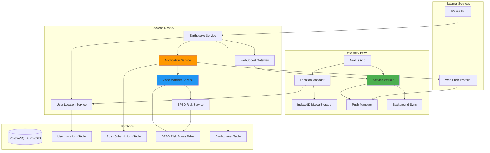

# Design Document: PWA Earthquake Notification dengan Background Sync dan Location-Based Alerts

## Overview

Sistem notifikasi gempa berbasis PWA (Progressive Web App) yang dapat menyimpan lokasi pengguna, berjalan di background, dan secara otomatis menampilkan notifikasi push ketika terjadi gempa yang mempengaruhi zona lokasi pengguna. Sistem ini mengintegrasikan data gempa real-time dari BMKG, zona risiko BPBD, dan lokasi pengguna untuk memberikan peringatan yang akurat dan kontekstual.

Fitur ini meningkatkan sistem notifikasi yang sudah ada dengan menambahkan:

1. **Persistent Location Storage** - Menyimpan lokasi pengguna di database dan localStorage
2. **Background Sync** - Service worker yang aktif di background untuk menerima notifikasi
3. **Zone-Based Matching** - Algoritma untuk mencocokkan lokasi pengguna dengan zona risiko gempa
4. **Smart Notification Logic** - Notifikasi hanya dikirim jika pengguna berada dalam radius dampak gempa

## Architecture



````

## Main Algorithm/Workflow

```mermaid
sequenceDiagram
    participant User
    participant PWA as PWA Frontend
    participant SW as Service Worker
    participant Backend as NestJS Backend
    participant BMKG as BMKG API
    participant DB as PostgreSQL+PostGIS

    Note over User,DB: 1. Initial Setup & Location Storage
    User->>PWA: Buka aplikasi
    PWA->>User: Request location permission
    User->>PWA: Grant permission
    PWA->>PWA: Get current location (lat, lng)
    PWA->>Backend: POST /user-location/save
    Backend->>DB: Save user location + userId
    PWA->>PWA: Store location in localStorage
    PWA->>SW: Register service worker
    SW->>Backend: Subscribe to push notifications
    Backend->>DB: Save push subscription

    Note over User,DB: 2. Background Earthquake Detection
    BMKG->>Backend: New earthquake data (cron job)
    Backend->>Backend: Parse earthquake data
    Backend->>DB: Save earthquake to database
    Backend->>Backend: Calculate impact radius (R = M^2.5 * 1.5)

    Note over User,DB: 3. Zone Matching & Notification Logic
    Backend->>DB: Query all user locations
    loop For each user location
        Backend->>Backend: Calculate distance to epicenter
        Backend->>DB: Check if location in BPBD risk zone
        Backend->>Backend: Determine threat level (RED/YELLOW/GREEN)
        alt User in danger zone (distance < impact radius)
            Backend->>DB: Get user's push subscription
            Backend->>SW: Send push notification via Web Push
            SW->>SW: Show notification with vibration
            SW->>PWA: Post message to open tabs
            PWA->>User: Display in-app toast + notification
        else User safe
            Backend->>Backend: Skip notification
        end
    end

    Note over User,DB: 4. User Interaction
    User->>SW: Click notification
    SW->>PWA: Open app with emergency=true
    PWA->>Backend: GET /evacuation/route
    Backend->>DB: Calculate safe evacuation route
    Backend->>PWA: Return route data
    PWA->>User: Display evacuation map
````
