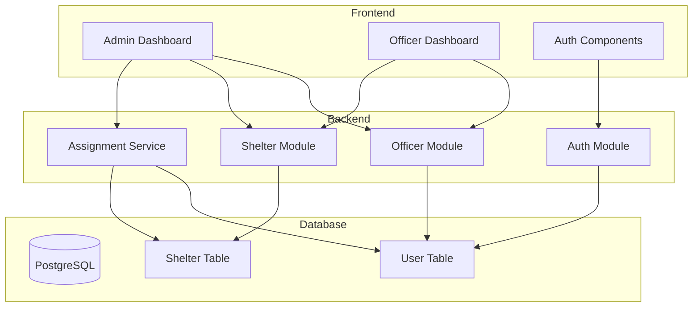

# Design Document: Shelter Officer Management

## Overview

The Shelter Officer Management feature extends the existing disaster management system to enable comprehensive management of shelter officers and their assigned evacuation facilities. The system consists of three main components:

1. **Database Layer**: Prisma schema modifications to establish relationships between shelters and officers
2. **Backend API**: NestJS services and controllers for officer management, assignments, and shelter updates
3. **Frontend Interface**: Next.js pages and components for admin management and officer dashboards

The design integrates seamlessly with the existing authentication system (JWT with role-based guards), shelter management functionality, and UI styling (dark theme with Tailwind CSS).

## Architecture

### System Components



### Data Flow

**Admin Officer Assignment Flow:**

1. Admin authenticates with JWT (ADMIN role)
2. Admin selects officer and shelter from UI
3. Frontend sends assignment request to backend
4. Backend validates admin role and officer/shelter existence
5. Backend updates shelter record with officer foreign key
6. Backend returns updated assignment data
7. Frontend updates UI to reflect new assignment

**Officer Dashboard Flow:**

1. Officer authenticates with JWT (SHELTER_OFFICER role)
2. Frontend requests assigned shelters from backend
3. Backend queries shelters where officerId matches authenticated user
4. Backend returns shelter list with current data
5. Frontend displays shelters in dashboard with statistics

**Occupancy Update Flow:**

1. Officer submits occupancy update from dashboard
2. Frontend sends update request with shelter ID and new value
3. Backend validates officer owns the shelter
4. Backend validates occupancy value (non-negative, within capacity)
5. Backend updates shelter record with new occupancy and timestamp
6. Backend returns updated shelter data
7. Frontend updates dashboard display

## Components and Interfaces

### Database Schema Changes

**Shelter Model Extension:**

```prisma
model Shelter {
  id          String   @id @default(uuid())
  name        String
  location    String
  capacity    Int
  occupancy   Int      @default(0)
  condition   ShelterCondition @default(OPERATIONAL)
  latitude    Float
  longitude   Float
  officerId   String?  // Foreign key to User
  officer     User?    @relation(fields: [officerId], references: [id], onDelete: SetNull)
  updatedAt   DateTime @updatedAt
  createdAt   DateTime @default(now())
}

enum ShelterCondition {
  OPERATIONAL
  DAMAGED
  FULL
  CLOSED
}
```

**User Model Extension:**

```prisma
model User {
  id              String   @id @default(uuid())
  username        String   @unique
  password        String
  fullName        String
  contactInfo     String?
  role            UserRole
  managedShelters Shelter[] // Reverse relation
  createdAt       DateTime @default(now())
  updatedAt       DateTime @updatedAt
}

enum UserRole {
  ADMIN
  USER
  SHELTER_OFFICER
}
```

### Backend API Interfaces

**Officer Service Interface:**

```typescript
interface OfficerService {
  // Officer CRUD operations
  createOfficer(dto: CreateOfficerDto): Promise<User>;
  findAllOfficers(): Promise<User[]>;
  findOfficerById(id: string): Promise<User>;
  updateOfficer(id: string, dto: UpdateOfficerDto): Promise<User>;
  deleteOfficer(id: string): Promise<void>;

  // Assignment operations
  getOfficerAssignments(officerId: string): Promise<Shelter[]>;
  getOfficerStatistics(officerId: string): Promise<OfficerStats>;
}

interface CreateOfficerDto {
  username: string;
  password: string;
  fullName: string;
  contactInfo?: string;
}

interface UpdateOfficerDto {
  fullName?: string;
  contactInfo?: string;
  password?: string;
}

interface OfficerStats {
  totalShelters: number;
  totalCapacity: number;
  totalOccupancy: number;
  sheltersByCondition: Record<ShelterCondition, number>;
}
```

**Assignment Service Interface:**

```typescript
interface AssignmentService {
  assignOfficerToShelter(
    shelterId: string,
    officerId: string,
  ): Promise<Shelter>;
  unassignOfficerFromShelter(shelterId: string): Promise<Shelter>;
  getUnassignedShelters(): Promise<Shelter[]>;
  bulkAssign(assignments: AssignmentDto[]): Promise<Shelter[]>;
}

interface AssignmentDto {
  shelterId: string;
  officerId: string;
}
```

**Shelter Update Service Interface:**

```typescript
interface ShelterUpdateService {
  updateOccupancy(
    shelterId: string,
    occupancy: number,
    officerId: string,
  ): Promise<Shelter>;
  updateCondition(
    shelterId: string,
    condition: ShelterCondition,
    officerId: string,
  ): Promise<Shelter>;
  validateOfficerOwnership(
    shelterId: string,
    officerId: string,
  ): Promise<boolean>;
}

interface UpdateOccupancyDto {
  occupancy: number;
}

interface UpdateConditionDto {
  condition: ShelterCondition;
}
```

### Frontend Component Interfaces

**Admin Officer Management Page:**

```typescript
interface OfficerManagementPage {
  officers: OfficerWithStats[];
  shelters: Shelter[];
  onCreateOfficer: (data: CreateOfficerForm) => Promise<void>;
  onEditOfficer: (id: string, data: UpdateOfficerForm) => Promise<void>;
  onDeleteOfficer: (id: string) => Promise<void>;
  onAssignShelter: (officerId: string, shelterId: string) => Promise<void>;
  onUnassignShelter: (shelterId: string) => Promise<void>;
}

interface OfficerWithStats {
  id: string;
  username: string;
  fullName: string;
  contactInfo?: string;
  assignedShelters: Shelter[];
  statistics: OfficerStats;
}
```

**Officer Dashboard Page:**

```typescript
interface OfficerDashboardPage {
  shelters: Shelter[];
  statistics: OfficerStats;
  onUpdateOccupancy: (shelterId: string, occupancy: number) => Promise<void>;
  onUpdateCondition: (
    shelterId: string,
    condition: ShelterCondition,
  ) => Promise<void>;
  onRefresh: () => Promise<void>;
}

interface ShelterCard {
  shelter: Shelter;
  onUpdateOccupancy: (occupancy: number) => void;
  onUpdateCondition: (condition: ShelterCondition) => void;
}
```

### API Endpoints

**Officer Management (Admin only):**

- `POST /api/officers` - Create new officer
- `GET /api/officers` - List all officers
- `GET /api/officers/:id` - Get officer details
- `PATCH /api/officers/:id` - Update officer
- `DELETE /api/officers/:id` - Delete officer
- `GET /api/officers/:id/shelters` - Get officer's assigned shelters
- `GET /api/officers/:id/statistics` - Get officer statistics

**Assignment Management (Admin only):**

- `POST /api/assignments` - Assign officer to shelter
- `DELETE /api/assignments/:shelterId` - Unassign officer from shelter
- `GET /api/assignments/unassigned` - Get shelters without officers
- `POST /api/assignments/bulk` - Bulk assign officers

**Officer Dashboard (Shelter Officer only):**

- `GET /api/officer/dashboard` - Get authenticated officer's dashboard data
- `GET /api/officer/shelters` - Get authenticated officer's shelters
- `PATCH /api/officer/shelters/:id/occupancy` - Update shelter occupancy
- `PATCH /api/officer/shelters/:id/condition` - Update shelter condition

## Data Models

### User Entity (Extended)

```typescript
class User {
  id: string;
  username: string;
  password: string; // Hashed with bcrypt
  fullName: string;
  contactInfo?: string;
  role: UserRole;
  managedShelters: Shelter[];
  createdAt: Date;
  updatedAt: Date;
}
```

### Shelter Entity (Extended)

```typescript
class Shelter {
  id: string;
  name: string;
  location: string;
  capacity: number;
  occupancy: number;
  condition: ShelterCondition;
  latitude: number;
  longitude: number;
  officerId?: string;
  officer?: User;
  updatedAt: Date;
  createdAt: Date;
}
```

### DTOs and Response Types

```typescript
// Request DTOs
class CreateOfficerDto {
  username: string;
  password: string;
  fullName: string;
  contactInfo?: string;
}

class UpdateOfficerDto {
  fullName?: string;
  contactInfo?: string;
  password?: string;
}

class AssignOfficerDto {
  officerId: string;
}

class UpdateOccupancyDto {
  occupancy: number;
}

class UpdateConditionDto {
  condition: ShelterCondition;
}

// Response DTOs
class OfficerResponseDto {
  id: string;
  username: string;
  fullName: string;
  contactInfo?: string;
  role: UserRole;
  assignedSheltersCount: number;
}

class OfficerDetailResponseDto extends OfficerResponseDto {
  assignedShelters: ShelterResponseDto[];
  statistics: OfficerStatsDto;
}

class OfficerStatsDto {
  totalShelters: number;
  totalCapacity: number;
  totalOccupancy: number;
  occupancyRate: number;
  sheltersByCondition: Record<ShelterCondition, number>;
}

class ShelterResponseDto {
  id: string;
  name: string;
  location: string;
  capacity: number;
  occupancy: number;
  condition: ShelterCondition;
  latitude: number;
  longitude: number;
  officer?: {
    id: string;
    fullName: string;
  };
  updatedAt: Date;
}

class DashboardResponseDto {
  shelters: ShelterResponseDto[];
  statistics: OfficerStatsDto;
  officer: {
    id: string;
    fullName: string;
  };
}
```

## Correctness Properties

A property is a characteristic or behavior that should hold true across all valid executions of a system—essentially, a formal statement about what the system should do. Properties serve as the bridge between human-readable specifications and machine-verifiable correctness guarantees.

### Property Reflection

After analyzing all acceptance criteria, several redundancies were identified:

- Requirements 1.3, 3.4, 5.1, and 9.3 all test the same behavior: retrieving an officer's assigned shelters
- Requirements 1.4 and 2.5 both test cascade deletion behavior
- Requirements 6.4, 7.3, and 8.2 all test officer ownership validation
- Requirements 6.5 and 7.4 both test timestamp updates
- Requirements 1.5 and 10.1 both test role validation for assignments

These have been consolidated into single comprehensive properties to avoid redundant testing.

### Core Data Relationship Properties

**Property 1: Officer shelter query completeness**
_For any_ officer with SHELTER_OFFICER role, querying their assigned shelters should return exactly the set of shelters where officerId matches their user ID, with no duplicates and no shelters assigned to other officers.
**Validates: Requirements 1.3, 3.4, 5.1, 9.3**

**Property 2: Officer deletion cascade**
_For any_ officer with assigned shelters, deleting that officer should result in all previously assigned shelters having null officer references, and the officer should be successfully removed from the system.
**Validates: Requirements 1.4, 2.5**

**Property 3: Role-based assignment validation**
_For any_ user without SHELTER_OFFICER role, attempting to assign them to a shelter should be rejected with a validation error, while users with SHELTER_OFFICER role should be assignable.
**Validates: Requirements 1.5, 10.1**

### Officer Management Properties

**Property 4: Officer creation role assignment**
_For any_ valid officer creation request, the created user should have SHELTER_OFFICER role, and all provided fields (username, fullName, contactInfo) should be stored correctly.
**Validates: Requirements 2.1**

**Property 5: Officer creation validation**
_For any_ officer creation request missing required fields (username, password, or fullName), the system should reject the request with a validation error.
**Validates: Requirements 2.2**

**Property 6: Officer list filtering**
_For any_ officer list query, the returned set should contain exactly all users with SHELTER_OFFICER role and no users with other roles.
**Validates: Requirements 2.3**

**Property 7: Officer update role preservation**
_For any_ officer update operation with valid data, the user record should be updated with the new values, but the role should remain SHELTER_OFFICER.
**Validates: Requirements 2.4**

### Assignment Management Properties

**Property 8: Officer assignment updates shelter reference**
_For any_ valid officer-to-shelter assignment, the shelter's officerId field should be updated to the assigned officer's ID, and subsequent queries should reflect this assignment.
**Validates: Requirements 3.1**

**Property 9: Officer unassignment clears shelter reference**
_For any_ shelter with an assigned officer, unassigning the officer should set the shelter's officerId to null, and subsequent queries should show no officer assigned.
**Validates: Requirements 3.2**

**Property 10: Shelter query includes officer data**
_For any_ shelter with an assigned officer, querying that shelter should include the officer's information (id and fullName) in the response.
**Validates: Requirements 3.3**

**Property 11: Multiple shelter assignment**
_For any_ officer, assigning them to multiple shelters should result in all assignments being stored correctly, and querying the officer should return all assigned shelters.
**Validates: Requirements 3.5**

### Authentication and Authorization Properties

**Property 12: Officer authentication token generation**
_For any_ valid SHELTER_OFFICER credentials, authentication should succeed and return a JWT token that, when decoded, contains the user ID and SHELTER_OFFICER role.
**Validates: Requirements 4.1**

**Property 13: Protected route authorization**
_For any_ protected officer endpoint accessed with a valid SHELTER_OFFICER token, the request should be authorized and processed successfully.
**Validates: Requirements 4.2**

**Property 14: Invalid token rejection**
_For any_ malformed, expired, or invalid JWT token, requests to protected endpoints should be rejected with a 401 authentication error.
**Validates: Requirements 4.3**

### Dashboard and Data Retrieval Properties

**Property 15: Shelter response completeness**
_For any_ shelter in a dashboard or list response, the response should include all required fields: name, location, occupancy, capacity, condition, latitude, longitude, and updatedAt.
**Validates: Requirements 5.2**

**Property 16: Officer statistics calculation**
_For any_ officer with assigned shelters, the calculated statistics should correctly sum totalShelters (count), totalCapacity (sum of all shelter capacities), totalOccupancy (sum of all shelter occupancies), and occupancyRate (totalOccupancy / totalCapacity).
**Validates: Requirements 5.4**

### Occupancy Management Properties

**Property 17: Occupancy update persistence**
_For any_ valid occupancy update on an officer's assigned shelter, the new occupancy value should be saved, and subsequent queries should return the updated value.
**Validates: Requirements 6.1**

**Property 18: Non-negative occupancy validation**
_For any_ occupancy update with a negative value, the system should reject the request with a validation error.
**Validates: Requirements 6.2**

**Property 19: Occupancy capacity validation**
_For any_ occupancy update where the value exceeds the shelter's capacity, the system should reject the request with a validation error.
**Validates: Requirements 6.3**

**Property 20: Officer ownership validation for updates**
_For any_ shelter not assigned to the requesting officer, attempts to update occupancy or condition should be rejected with a 403 authorization error.
**Validates: Requirements 6.4, 7.3, 8.2**

**Property 21: Update timestamp recording**
_For any_ successful shelter update (occupancy or condition), the shelter's updatedAt timestamp should be set to the current time and be more recent than the previous timestamp.
**Validates: Requirements 6.5, 7.4**

### Condition Management Properties

**Property 22: Condition update persistence**
_For any_ valid condition update on an officer's assigned shelter, the new condition value should be saved, and subsequent queries should return the updated value.
**Validates: Requirements 7.1**

**Property 23: Condition enum validation**
_For any_ condition update with a value not in the set {OPERATIONAL, DAMAGED, FULL, CLOSED}, the system should reject the request with a validation error.
**Validates: Requirements 7.2**

### Authorization Properties

**Property 24: Non-officer role rejection**
_For any_ user without SHELTER_OFFICER role attempting to access officer-specific endpoints, the system should reject the request with a 403 authorization error.
**Validates: Requirements 8.1**

**Property 25: Admin full access**
_For any_ admin user accessing officer management or assignment endpoints, all operations should be authorized and execute successfully.
**Validates: Requirements 8.3**

**Property 26: Authorization error status codes**
_For any_ authentication failure (invalid/missing token), the system should return 401 status code; for any authorization failure (insufficient permissions), the system should return 403 status code.
**Validates: Requirements 8.5**

### Admin Overview Properties

**Property 27: Officer overview completeness**
_For any_ officer overview query, the response should include all SHELTER_OFFICER users with their assignment counts correctly calculated as the number of shelters where officerId matches the officer's ID.
**Validates: Requirements 9.1**

**Property 28: Officer detail response structure**
_For any_ officer in the overview response, the data should include fullName, contactInfo, and assignedSheltersCount fields.
**Validates: Requirements 9.2**

**Property 29: Officer search filtering**
_For any_ search query on the officer list, all returned results should match the search criteria (username or fullName contains the search term), and no non-matching officers should be included.
**Validates: Requirements 9.5**

### Data Integrity Properties

**Property 30: Shelter update field validation**
_For any_ shelter update request with missing required fields or improperly formatted values, the system should reject the request with a validation error describing the issue.
**Validates: Requirements 10.2**

**Property 31: Shelter deletion cascade handling**
_For any_ shelter with an assigned officer, deleting the shelter should succeed without leaving orphaned references, and the officer should no longer show that shelter in their assigned list.
**Validates: Requirements 10.3**

**Property 32: Unique officer assignment**
_For any_ shelter, assigning a new officer when one is already assigned should replace the previous assignment, resulting in exactly one officer assigned (or null if unassigned).
**Validates: Requirements 10.4**

## Error Handling

### Error Categories

**Validation Errors (400 Bad Request):**

- Missing required fields in create/update requests
- Invalid data formats (negative occupancy, invalid enum values)
- Occupancy exceeding capacity
- Invalid search parameters

**Authentication Errors (401 Unauthorized):**

- Missing JWT token
- Expired JWT token
- Invalid/malformed JWT token
- Invalid credentials during login

**Authorization Errors (403 Forbidden):**

- User without SHELTER_OFFICER role accessing officer endpoints
- Officer attempting to update non-assigned shelter
- User without ADMIN role accessing admin endpoints

**Not Found Errors (404 Not Found):**

- Officer ID does not exist
- Shelter ID does not exist
- Requested resource not found

**Conflict Errors (409 Conflict):**

- Username already exists when creating officer
- Attempting to delete officer with active assignments (if business rules require unassignment first)

### Error Response Format

All errors should follow a consistent format:

```typescript
interface ErrorResponse {
  statusCode: number;
  message: string | string[];
  error: string;
  timestamp: string;
  path: string;
}
```

### Error Handling Strategy

**Backend:**

- Use NestJS exception filters for consistent error formatting
- Implement custom exceptions for domain-specific errors
- Log all errors with appropriate severity levels
- Sanitize error messages to avoid exposing sensitive information
- Use Prisma error handling for database constraint violations

**Frontend:**

- Display user-friendly error messages
- Show validation errors inline on forms
- Use toast notifications for operation results
- Implement retry logic for transient failures
- Provide fallback UI for error states

### Transaction Management

**Critical Operations Requiring Transactions:**

- Officer deletion with shelter unassignment
- Bulk officer assignments
- Shelter deletion with officer reference cleanup

**Transaction Strategy:**

- Use Prisma transactions for multi-step operations
- Implement rollback on any step failure
- Log transaction failures for debugging
- Return descriptive errors indicating which step failed

## Testing Strategy

### Dual Testing Approach

This feature requires both unit testing and property-based testing for comprehensive coverage:

**Unit Tests:**

- Specific examples demonstrating correct behavior
- Edge cases (empty lists, null values, boundary conditions)
- Error conditions and exception handling
- Integration points between services
- Mock external dependencies (database, auth)

**Property-Based Tests:**

- Universal properties that hold for all inputs
- Comprehensive input coverage through randomization
- Validate correctness properties from design document
- Minimum 100 iterations per property test
- Each test tagged with feature name and property number

### Property-Based Testing Configuration

**Library Selection:**

- **Backend (NestJS/TypeScript)**: Use `fast-check` library
- **Frontend (Next.js/TypeScript)**: Use `fast-check` library

**Test Configuration:**

```typescript
// Example property test configuration
fc.assert(
  fc.property(
    fc.record({
      username: fc.string({ minLength: 3, maxLength: 50 }),
      password: fc.string({ minLength: 8 }),
      fullName: fc.string({ minLength: 1 }),
      contactInfo: fc.option(fc.string()),
    }),
    async (officerData) => {
      // Feature: shelter-officer-management, Property 4: Officer creation role assignment
      const officer = await officerService.createOfficer(officerData);
      expect(officer.role).toBe(UserRole.SHELTER_OFFICER);
      expect(officer.username).toBe(officerData.username);
      expect(officer.fullName).toBe(officerData.fullName);
    },
  ),
  { numRuns: 100 },
);
```

### Test Organization

**Backend Tests:**

```
src/
  officers/
    officers.service.spec.ts          # Unit tests
    officers.service.property.spec.ts # Property tests
    officers.controller.spec.ts       # Controller unit tests
  assignments/
    assignments.service.spec.ts
    assignments.service.property.spec.ts
  shelter-updates/
    shelter-updates.service.spec.ts
    shelter-updates.service.property.spec.ts
```

**Frontend Tests:**

```
__tests__/
  admin/
    officer-management.test.tsx       # Component unit tests
    officer-management.property.test.tsx # Property tests
  officer/
    dashboard.test.tsx
    dashboard.property.test.tsx
```

### Test Coverage Requirements

**Minimum Coverage Targets:**

- Line coverage: 80%
- Branch coverage: 75%
- Function coverage: 85%
- Property test iterations: 100 per property

**Critical Paths Requiring 100% Coverage:**

- Authentication and authorization logic
- Officer ownership validation
- Data validation and sanitization
- Transaction rollback handling

### Integration Testing

**API Integration Tests:**

- Test complete request/response cycles
- Verify JWT token generation and validation
- Test role-based access control
- Verify database transactions and rollbacks

**End-to-End Tests:**

- Admin creates officer and assigns shelters
- Officer logs in and views dashboard
- Officer updates shelter occupancy and condition
- Admin unassigns officer and verifies shelter updates

### Test Data Management

**Test Database:**

- Use separate test database
- Reset database state between tests
- Use database transactions for test isolation
- Seed minimal required data (admin user, test shelters)

**Test Data Generators:**

```typescript
// Example generators for property tests
const arbitraryOfficer = fc.record({
  username: fc.string({ minLength: 3, maxLength: 50 }),
  password: fc.string({ minLength: 8 }),
  fullName: fc.string({ minLength: 1 }),
  contactInfo: fc.option(fc.string()),
});

const arbitraryShelter = fc.record({
  name: fc.string({ minLength: 1 }),
  location: fc.string({ minLength: 1 }),
  capacity: fc.integer({ min: 10, max: 1000 }),
  occupancy: fc.integer({ min: 0, max: 1000 }),
  condition: fc.constantFrom("OPERATIONAL", "DAMAGED", "FULL", "CLOSED"),
  latitude: fc.double({ min: -90, max: 90 }),
  longitude: fc.double({ min: -180, max: 180 }),
});

const arbitraryOccupancyUpdate = fc.integer({ min: 0, max: 1000 });
```

### Mocking Strategy

**Backend Mocks:**

- Mock Prisma client for unit tests
- Use real database for integration tests
- Mock JWT service for controller tests
- Mock external services (email, notifications)

**Frontend Mocks:**

- Mock API calls using MSW (Mock Service Worker)
- Mock Next.js router
- Mock authentication context
- Use React Testing Library for component tests

### Performance Testing

**Load Testing Scenarios:**

- Multiple officers updating shelters simultaneously
- Admin bulk assigning officers to shelters
- Dashboard loading with many assigned shelters
- Concurrent authentication requests

**Performance Targets:**

- API response time: < 200ms for single operations
- Dashboard load time: < 500ms for up to 50 shelters
- Bulk assignment: < 2s for 100 assignments
- Authentication: < 100ms

### Security Testing

**Security Test Cases:**

- SQL injection attempts in search queries
- JWT token tampering
- Cross-site scripting (XSS) in text fields
- Authorization bypass attempts
- Rate limiting for authentication endpoints
- Password strength validation
